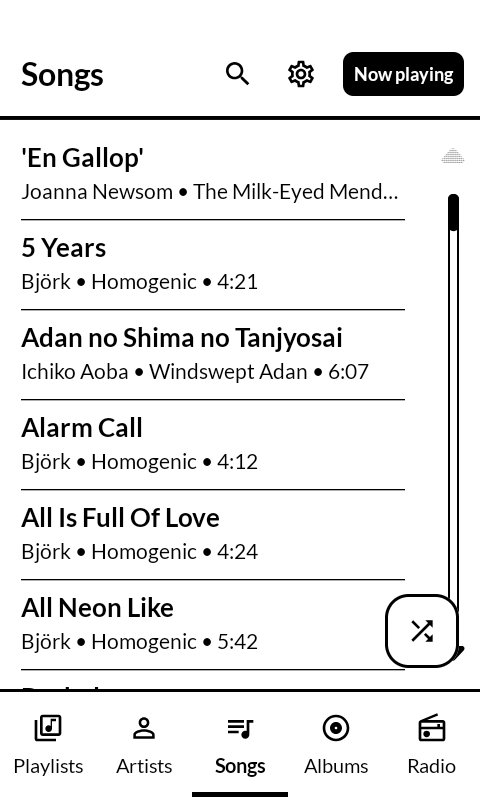
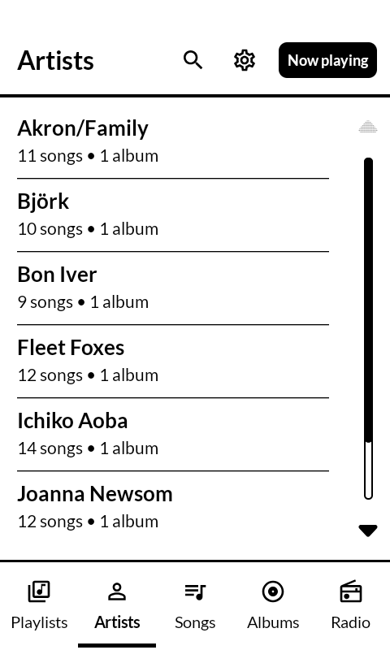
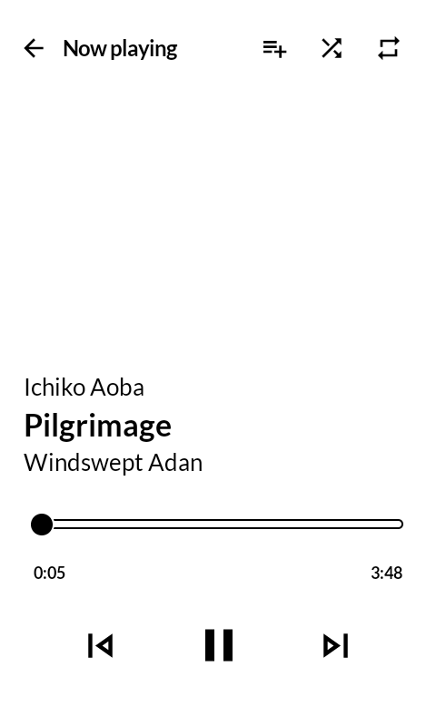
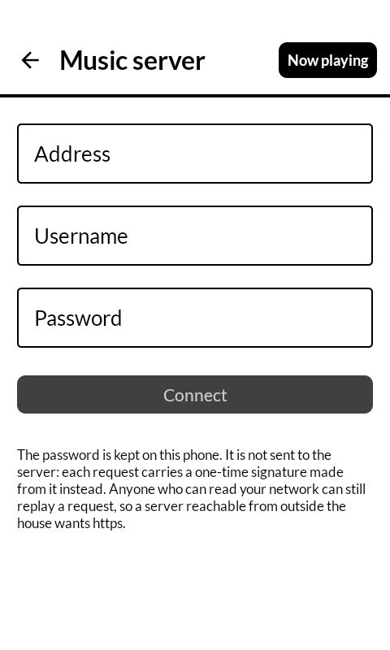

# 自鳴琴 jimeikin — Music Box

A music player for the [Mudita Kompakt](https://mudita.com/products/mudita-kompakt), for a
local library, for a Navidrome or other Subsonic server, and for YouTube Music search and
streaming.

*Jimeikin* is 自鳴琴 — a koto that sounds itself. It is what a music box was called before
オルゴール, the Dutch loanword, took the name over: 自 (self), 鳴 (to sound), 琴 (koto). It
names an instrument that plays with nobody sitting at it, which is what this is once it is on
the phone.

Fork of [CalmMusic](https://github.com/davidraywilson/CalmMusic) by
[David Ray Wilson](https://github.com/davidraywilson), adapted to the Kompakt's e-ink display
and Mudita's MMD design system. CalmMusic is no longer maintained upstream; its author moved
on to a different project.

| | |
|---|---|
|  |  |
|  |  |

## Local music

The cog, top right → **Add a folder**. The picker opens on the memory card if there is one,
and on the phone's own Music folder if not. Supported audio files are indexed into songs,
albums, artists and playlists, and play offline.

Artists are grouped by album artist where the files carry one, so an album credited to a
single artist stays a single artist however many guests appear on its tracks.

Any `.m3u` or `.m3u8` file inside a chosen folder becomes a playlist, in file order. Entries
naming files that are not on the phone are skipped. Editing the file on a computer and
scanning again rewrites that playlist rather than making a second one.

A folder that cannot be read — a card that has not mounted yet, a folder that has gone away —
is reported as unread, and nothing under it leaves the library.

## A music server

Settings → **Music server**. Address, username, password, and it reads the whole library in
one go — artists, albums and songs appear beside the music on the card rather than in a room
of their own. Anything Subsonic answers works: Navidrome, Airsonic, Gonic.

A song held both on the server and on the card is shown once, and it is the copy on the card
that survives, because that one plays with no network. The server goes on earning its place
for everything the card does not have. A dotted rule under a row means it needs the network.

Long press a song for **Keep on this phone**, or use the button on an album or an artist to
keep the lot. A kept song stops being a pointer to the server and becomes a file: solid rule,
plays offline, and a later sync leaves it alone. Formats the phone cannot decode are asked for
as mp3 instead of raw, so a Windows Media or Musepack track arrives playable.

The server's playlists come across too, pointing at the copy on the phone wherever there is
one. A playlist already here under the same name is left alone — a server that keeps its
library on disk has usually imported the very `.m3u` files this app reads off the card.

**The password is kept on this phone**, because Subsonic signs each request with it rather
than sending it. That signature keeps the password off the wire; it does not stop anyone on
the wire replaying a request, so a server reachable from outside the house wants https.

## YouTube Music

Start typing in Search. No account is needed to search or to stream.

Artist pages list an artist's top songs, albums and singles. When you are looking at a local
album, missing tracks can be found and filled in from YouTube. Tracks can be downloaded for
offline playback; downloads have their own screen.

Connecting a YouTube account under Settings → Streaming makes search reflect it. Nothing else
in the app needs one.

Respect artists' rights and your local laws when streaming or downloading from YouTube.

## The queue

One now-playing queue, mixing local files and YouTube tracks. Shuffle and repeat without
losing your place. The Now Playing screen is large type and little else.

## Installing

Android 9 (API 28) or newer.

Upgrading from an older copy needs an uninstall first: Android will not install this over one,
and stops with `INSTALL_FAILED_UPDATE_INCOMPATIBLE`. Uninstalling clears playlists, settings
and anything cached; music files in your own storage are untouched. Updates after this one
install normally.

## What it sends

Your settings and local library stay on the phone. The YouTube features talk to YouTube and
YouTube Music, only to search and stream audio. There are no ads, no analytics and no tracking
SDKs. The same is said in the app, behind the **i** in the top right.

It asks for five permissions and uses all five: the network, a foreground service and its
notification for playback, and an exemption from battery optimisation so the system is less
likely to stop it. It does not ask for storage — folders are reached through the system
picker, which grants this app that folder and nothing else.

Two permissions are optional and are asked for only on the Radio screen, at the moment they
are needed: reading the FM tuner's now-playing notification to show the frequency, and an
accessibility service whose whole job is to press play in the tuner and come back. Neither is
required to use the rest of the app.

## For developers

Android Studio, JDK 21, Android SDK Platform 37+, and a device or emulator on Android 9
(API 28) or newer. Clone, open in Android Studio, let Gradle sync, run the `app`
configuration.

```sh
./gradlew :app:assembleDebug     # or :app:assembleRelease
./gradlew :app:installDebug
```

Both build types share a checked-in debug-style keystore; see `app/build.gradle.kts`. A
tagged push (`v*`) triggers a GitHub Actions release build that publishes a signed APK to
Releases.

## Credits

- Built on [CalmMusic](https://github.com/davidraywilson/CalmMusic) by David Ray Wilson (GPL-3.0).
- YouTube stream resolution via [NewPipeExtractor](https://github.com/TeamNewPipe/NewPipeExtractor) by TeamNewPipe (GPL-3.0).
- UI built with Mudita's MMD component library for Kompakt.

## Licence

GPL-3.0, the same as upstream CalmMusic. See [LICENSE](LICENSE).
